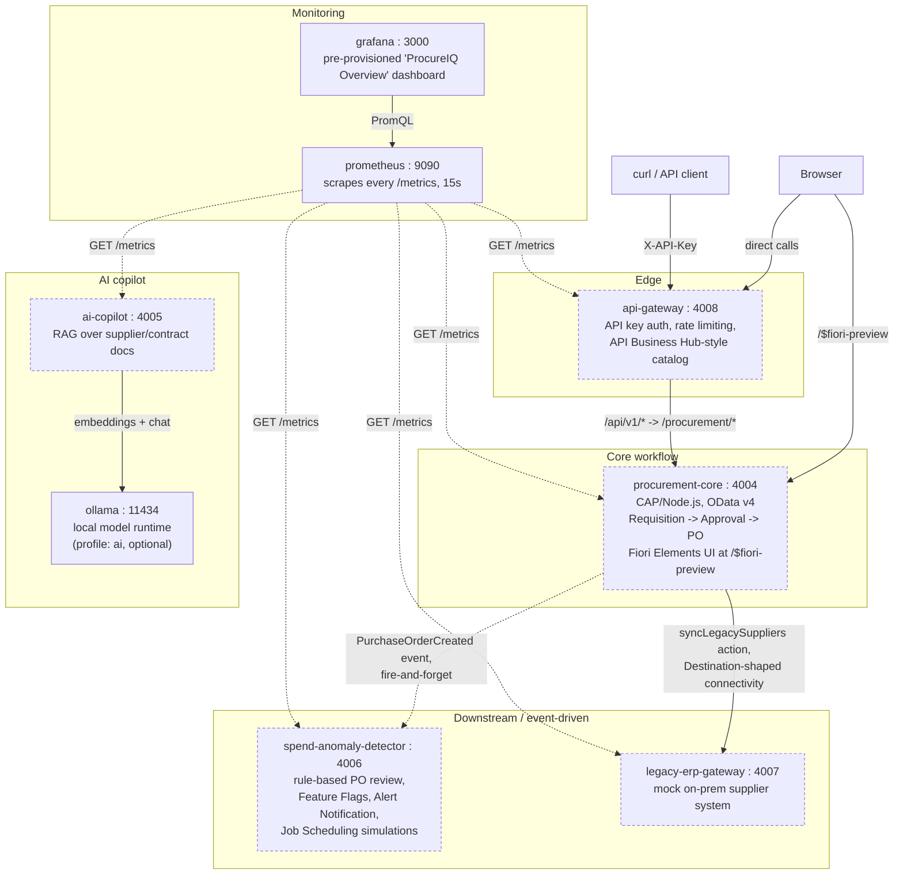
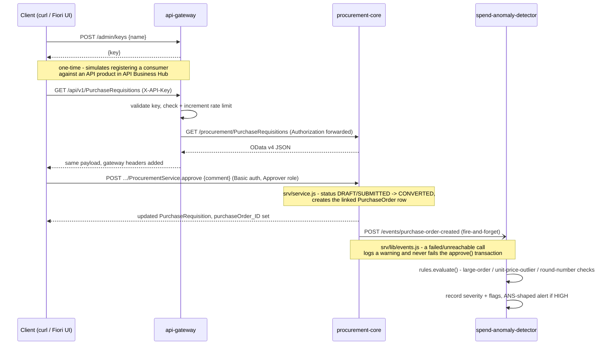

# SAP BTP Platform Engineering — ProcureIQ

> **Status: deployed and live on a real SAP BTP trial subaccount.** All five services below run locally with zero BTP account needed (see [Quick start](#quick-start)) — and are *also* actually deployed and reachable right now on Cloud Foundry, real infra provisioned by `infra/terraform`, real bugs found and fixed getting there. See [Live on BTP](#live-on-btp) for the real URLs.

A hands-on, production-grade platform engineering project on **SAP Business Technology Platform**, built around a real SAP extension scenario — procurement (Purchase Requisition → Purchase Order → Supplier → Contract) — and covering the full SAP DevOps toolchain: CAP, ABAP Cloud/RAP, Cloud Foundry + Kyma, HANA Cloud, XSUAA, Terraform, Project Piper, Cloud Transport Management, gCTS, Integration Suite, and an AI copilot layer (SAP AI Core / Generative AI Hub, with a trial-compatible fallback).

Read [`PROJECT_CHARTER.md`](./PROJECT_CHARTER.md) first — it has the why, the scope decisions, and the domain coverage map. [`docs/concepts/00-scope-boundaries.md`](./docs/concepts/00-scope-boundaries.md) is worth reading right after — it states plainly what this project deliberately does *not* cover, and why.

### Contents
- [Live on BTP](#live-on-btp)
- [Architecture](#architecture)
- [How it all works](#how-it-all-works)
- [What mirrors what](#what-mirrors-what)
- [Quick start](#quick-start)
- [Testing and navigating it](#testing-and-navigating-it)
- [Deployed on BTP: infra, networking, and navigation](#deployed-on-btp-infra-networking-and-navigation)
- [Monitoring and observability](#monitoring-and-observability)
- [Port map](#port-map)
- [Verified: a real end-to-end run](#verified-a-real-end-to-end-run)
- [Known limitations](#known-limitations--honesty-notes)
- [Coverage](#coverage)

## Live on BTP

Real, currently-deployed instances (org `4cbf0c12trial`, space `dev`) —
every path below was tested directly against the live app just now, not
assumed. **Base URLs alone 404 or "Cannot GET /"** — none of these five
services defines a `/` route (verified, not a bug) — use the specific
paths below.

| Try it | URL |
|---|---|
| api-gateway health | https://api-gateway.cfapps.us10-001.hana.ondemand.com/health |
| api-gateway catalog | https://api-gateway.cfapps.us10-001.hana.ondemand.com/catalog |
| procurement-core health | https://4cbf0c12trial-dev-procurement-core-srv.cfapps.us10-001.hana.ondemand.com/health |
| ai-copilot health | https://ai-copilot.cfapps.us10-001.hana.ondemand.com/copilot/health |
| legacy-erp-gateway suppliers | https://legacy-erp-gateway.cfapps.us10-001.hana.ondemand.com/legacy/suppliers |
| spend-anomaly-detector reviews | https://spend-anomaly-detector.cfapps.us10-001.hana.ondemand.com/anomalies |
| spend-anomaly-detector alerts | https://spend-anomaly-detector.cfapps.us10-001.hana.ondemand.com/alerts |
| spend-anomaly-detector feature flags | https://spend-anomaly-detector.cfapps.us10-001.hana.ondemand.com/admin/flags |
| **procurement-core Fiori UI — open this one** | **https://4cbf0c12trial-dev-procurement-core-srv.cfapps.us10-001.hana.ondemand.com/$fiori-preview/ProcurementService/PurchaseRequisitions** |
| procurement-core raw OData reads | https://4cbf0c12trial-dev-procurement-core-srv.cfapps.us10-001.hana.ondemand.com/procurement/PurchaseRequisitions |

```bash
curl https://api-gateway.cfapps.us10-001.hana.ondemand.com/health
# -> {"status":"ok"}
curl https://ai-copilot.cfapps.us10-001.hana.ondemand.com/copilot/health
# -> {"status":"degraded","ollamaReachable":false,...} - real, expected, see below
```

**The Fiori UI link above is a genuine, cold-open, no-login link** —
open it in any browser, see real seeded requisition data immediately.
Confirmed directly: `GET .../$fiori-preview/...` and
`GET .../procurement/PurchaseRequisitions` both return real `200`s
with **zero auth header**, real UI5-bootstrapped HTML and real seeded
data respectively. This is a deliberate choice, not an oversight —
`srv/service.cds`'s `ProcurementService` is explicitly annotated
`requires: 'any'` at the **service** level, with `@restrict` on the
two writable entities keeping every mutation (`CREATE`/`UPDATE`/
`DELETE`, plus `submit`/`approve`/`rejectRequisition`) exactly as
role-gated as before — confirmed directly: `POST
/procurement/PurchaseRequisitions` with no auth still returns `401`.

**Two real bugs found and fixed getting reads public on the deployed
instance, not just locally** (both root-caused and fixed this session,
full detail in `services/procurement-core/README.md`'s "Known
limitations"):
1. `POST /procurement/PurchaseRequisitions` originally `500`'d —
   `duplicate column name: STATUS` in the generated HANA INSERT.
   Root cause: `srv/service-ui.cds`'s old `status as statusText :
   String` aliased the computed `statusText` column directly to the
   real `status` column, and HANA's compiler resolved that alias back
   to the source name when building the base table's writable columns
   — a literal duplicate. SQLite (local dev) never hit this. Fixed by
   rewriting `statusText`'s expression as a `case/when` mapping to
   identical string values instead of a direct 1:1 alias.
2. Marking entities `@requires: 'any'`/`@restrict` alone didn't
   actually make reads public once deployed — every read still `401`'d
   even after that change. Root cause, found directly in `@sap/cds`'s
   own framework source
   (`node_modules/@sap/cds/lib/srv/protocols/http.js`): CAP's HTTP
   adapter applies a separate, **service-wide** gate ahead of any
   entity-level rule — in production it defaults every service to
   requiring `authenticated-user` unless the *service itself* opts out.
   The entity-level rules were correct the whole time; they just never
   got a chance to run. Fixed by adding `requires: 'any'` to
   `ProcurementService`'s own top-level annotation, alongside the
   entity-level rules (which remain the real, finer-grained
   enforcement).

**These may return nothing when you try them.** SAP BTP trial accounts
auto-stop idle resources — confirmed for both Cloud Foundry apps
(`cf apps` showed `requested state: stopped` after a period of
inactivity) *and*, separately, the HANA Cloud database itself (real
error hit live: `procurement-core-db-deployer`'s task failed with
"HANA Database instance is stopped" until resumed via `cf update-service
procureiq-dev-hana-cloud -c '{"data":{"serviceStopped":false}}' --wait`,
confirmed to take a few minutes, same order of magnitude as its
original creation). Neither is a bug in this project — real platform
behavior. If a URL times out or 404s where this table says it should
200, the app or the database is almost certainly just stopped, not
gone — see [Deployed on BTP](#deployed-on-btp-infra-networking-and-navigation)
below for exactly how to check and restart one (`cf start <app>`, or
the cockpit's own Start button — no CLI needed).

**`ai-copilot` is deliberately "degraded", not broken.** No real AI
backend is connected on CF — no self-hosted Ollama (that's local-only,
see [Quick start](#quick-start)), and SAP AI Core / Generative AI Hub
integration is a documented, not-yet-built follow-up (needs BTP's paid
free tier, not the plain trial — see `docs/concepts/09-ai-on-btp.md`).
Health/anomaly-review endpoints work fine; `/copilot/ask` returns an
error until a real model backend exists. This is the graceful-
degradation fix documented in [Verified](#verified-a-real-end-to-end-run)
below, not a limitation being glossed over.

## Architecture

Every box below actually runs — five services, all in this repo, plus one optional local LLM runtime. Boxes labeled `[BTP]` are what each simulated piece maps to in a real deployed landscape (see [What mirrors what](#what-mirrors-what)).



`procurement-core` is the hub: it owns the domain model and the only two outbound calls in the system (a synchronous connectivity call to `legacy-erp-gateway`, and a fire-and-forget event to `spend-anomaly-detector`). `api-gateway` is the only front door most external callers should use — it adds a policy layer (API keys, rate limiting) in front of `procurement-core`, it doesn't replace `procurement-core`'s own role-based access control. `ai-copilot` is deliberately not wired to any other service yet — it answers questions over its own document corpus, independent of the transactional flow.

## How it all works

### 1. The core workflow (Requisition → Approval → Purchase Order → downstream review)



Every mocked user and role (`alice`/`bob`/`carol`/`dave` — Requester/Approver/IntegrationAdmin) and the full requisition lifecycle (`DRAFT → SUBMITTED → CONVERTED`/`REJECTED`) are documented in [`services/procurement-core/README.md`](./services/procurement-core/README.md).

### 2. Legacy connectivity (the Cloud Connector / Destination simulation)

```mermaid
sequenceDiagram
    participant Client as Client (IntegrationAdmin)
    participant Core as procurement-core
    participant Legacy as legacy-erp-gateway

    Client->>Core: POST /procurement/syncLegacySuppliers (dave, IntegrationAdmin role)
    Core->>Core: getDestination('LEGACY_SUPPLIER_ERP')
    Note over Core: srv/lib/destination.js - shaped like the real<br/>SAP Destination service's getDestination() call;<br/>ProxyType: OnPremise signals this would tunnel<br/>through Cloud Connector for real
    Core->>Legacy: GET /legacy/suppliers
    Legacy-->>Core: cryptic legacy field names (CTRY_CD, RISK_CD, ...)
    Core->>Core: legacy-supplier-mapper.js - translate to the clean domain model
    Core-->>Client: {totalRecords, created, updated, skipped, errors}
```

`legacy-erp-gateway` is deliberately shaped like a real legacy on-prem system, not a clean BTP service — the mapping layer this forces `procurement-core` to write is a real, common integration task, not incidental plumbing. See [`services/legacy-erp-gateway/README.md`](./services/legacy-erp-gateway/README.md).

## What mirrors what

| This project | Mirrors this real-world BTP pattern |
|---|---|
| `procurement-core` | A CAP side-by-side extension of an S/4HANA-style core — Clean Core principle (extend around it, never modify it) |
| `api-gateway` | SAP API Management / API Business Hub — consumer keys, rate limiting, a discoverable API catalog in front of an OData service |
| `spend-anomaly-detector` | A Kyma-native, event-driven microservice — subscribes to a `PurchaseOrderCreated` topic on SAP Event Mesh in production; an HTTP webhook stands in locally (see that service's README for exactly why). **Deployed to CF temporarily** — its real target, Kyma, is blocked on SAP's trial-approval process, see `infra/terraform/README.md` |
| `legacy-erp-gateway` + `procurement-core`'s `destination.js` | Cloud Connector + the Destination service — the on-prem connectivity boundary, simulated since there's no real on-prem network segment to tunnel to from a laptop |
| `ai-copilot` | RAG over enterprise documents via SAP AI Core / Generative AI Hub in production; Ollama stands in locally since AI Core needs BTP's paid free tier, not the plain trial (see [Testing and navigating it](#testing-and-navigating-it) for the exact trial-vs-production split) |
| `spend-anomaly-detector`'s Feature Flags / Alert Notification / Job Scheduling simulations | SAP Feature Flags service, SAP Alert Notification Service, SAP Job Scheduling Service |
| `infra/terraform` | A real Terraform-provisioned BTP landing zone — subaccount, entitlements, CF org + Kyma cluster (gated, pending SAP approval), role collections — via the `SAP/btp` provider. **Applied for real** — see [Deployed on BTP](#deployed-on-btp-infra-networking-and-navigation) |

## Quick start

Every service is plain Node/Express (`procurement-core` runs CAP's `cds-serve` under the hood) — there's no SAP-specific local runtime to install. Docker is the local integration-testing layer on top of each service's own `npm test`, the same role a `docker compose up` stack plays in an AI/ML/LLM Ops-style project — it exists so the five services can be exercised as a real network of processes, not just in-process test doubles.

```bash
docker compose up --build              # procurement-core, spend-anomaly-detector,
                                        # legacy-erp-gateway, api-gateway,
                                        # prometheus, grafana
docker compose --profile ai up --build # + ai-copilot (needs Ollama - see below)
```

Prometheus and Grafana come up by default (not behind a profile) — they're genuinely lightweight and the whole point is seeing real metrics without an extra command. Open `http://localhost:3000` once everything's healthy; the "ProcureIQ Overview" dashboard is already there.

**Comes up already seeded — no manual setup step, ever:**
- `procurement-core`'s image runs `cds-deploy` at *build* time (not first-boot), which creates `db.sqlite` and loads every row in `db/data/*.csv` — six tables, real sample requisitions/orders/suppliers, baked into the image itself. A fresh `docker compose up --build` on a machine that has never seen this repo before gets exactly the same data as every other machine that runs it.
- `legacy-erp-gateway`'s five supplier records (`data/suppliers.json`) and `ai-copilot`'s five-document corpus (`corpus/*.md`) are committed source, copied into their images the same way.
- `spend-anomaly-detector` starts with an empty review log by design — it's a record of *what procurement-core sent it*, not reference data, and fills in as the workflow above runs.

Wait ~15-20 seconds for healthchecks, then `docker compose ps` — every container should read `healthy`.

**Is Ollama always required?** Only for `ai-copilot`, and only locally. `ai-copilot` genuinely cannot start without an embedding backend reachable — it ingests its document corpus at boot and exits if that call fails, rather than degrading (verified directly: `docker compose up` without the `ai` profile simply never starts this one container; the other four are unaffected). In a real deployed landscape `ai-copilot` doesn't call Ollama at all — the production path is SAP AI Core / Generative AI Hub, which needs BTP's free tier (a card-verification hold), not the plain 90-day trial this project targets first (see `docs/concepts/09-ai-on-btp.md`). Ollama exists purely as the free, local, trial-compatible stand-in for that seam — `services/ai-copilot/src/config.js`'s comment marks exactly where a `PROVIDER=ai-core` branch would go once free tier is enabled. To bring it up:
```bash
docker compose --profile ai up --build
docker compose exec ollama ollama pull all-minilm
docker compose exec ollama ollama pull qwen2.5:1.5b
```

Neither `docker compose down` nor a plain rebuild loses anything meaningful — the seeded data above is baked into the image layer, not a runtime volume, so it comes back identical every time. `docker compose down -v` also has nothing extra to wipe for the same reason (no named volumes hold state here except Ollama's pulled models).

## Testing and navigating it

Each service's own `npm test` (67/67 passing across the five services) already proves its logic in isolation. What the running stack above proves is that the same five services actually reach each other over a real network the way they will in production — every path below has been run for real, not assumed.

**Start here — the Fiori Elements UI**, generated from `procurement-core`'s own CDS annotations, zero hand-written frontend code:
```
http://localhost:4004/$fiori-preview/ProcurementService/PurchaseRequisitions#preview-app
```
Log in as `carol` / any password (CAP's mocked-auth strategy checks the username against `package.json`'s `cds.requires.auth.users` list and accepts any password for it — real CAP local-dev behavior, not a placeholder). `carol` holds both `Requester` and `Approver` roles, so she can create, submit, and approve a requisition end to end from the UI alone. `alice` (Requester only), `bob` (Approver only), and `dave` (`IntegrationAdmin`, can trigger `syncLegacySuppliers` but not the requisition workflow) demonstrate the role split — try the same action logged in as each to see CAP's RBAC actually enforce it.

**The full request chain, via curl:**
```bash
# 1. Register a consumer and get an API key (api-gateway)
curl -s -X POST http://localhost:4008/admin/keys \
  -H 'Content-Type: application/json' -d '{"name":"test-client"}'

# 2. Call procurement-core through the gateway
curl -s -H "X-API-Key: <key from step 1>" \
  http://localhost:4008/api/v1/PurchaseRequisitions

# 3. Approve a submitted requisition directly (bypassing the gateway - approve
#    isn't in the gateway's exposed catalog, see services/api-gateway/src/catalog.js)
curl -s -u bob:x -X POST \
  "http://localhost:4004/procurement/PurchaseRequisitions(<id>)/ProcurementService.approve" \
  -H 'Content-Type: application/json' -d '{"comment":"approved"}'

# 4. Confirm spend-anomaly-detector received the resulting PO event
curl -s http://localhost:4006/anomalies

# 5. Sync suppliers from the simulated legacy system
curl -s -u dave:x -X POST http://localhost:4004/procurement/syncLegacySuppliers
```

**Every service's own README documents its full endpoint list and a guided walkthrough** — `services/procurement-core/README.md` ("Try the actual workflow"), `services/api-gateway/README.md`, `services/spend-anomaly-detector/README.md` (Feature Flags, Job Scheduling, Alert Notification endpoints), `services/legacy-erp-gateway/README.md`, `services/ai-copilot/README.md` (RAG query/trace endpoints). None of these services currently publish an OpenAPI/Swagger document of their own — `procurement-core`'s CDS-generated `$metadata` (OData v4's own machine-readable service description, at `/procurement/$metadata`) is the closest equivalent, and is what the Fiori preview UI itself reads to render its screens.

**Testing by SAP DevOps discipline** — which piece to look at depends on the question being asked:

| Question | Where to look |
|---|---|
| "Does the approval workflow enforce roles correctly?" | `services/procurement-core/test/`, and the curl walkthrough above logged in as each mocked user |
| "Does the API layer actually rate-limit and authenticate?" | `services/api-gateway/test/`, or hammer step 2 above more than 10×/minute and watch it 429 |
| "Does the system degrade gracefully when a downstream service is down?" | `docker compose stop legacy-erp-gateway`, then retry `syncLegacySuppliers` — a documented, real bug (see [Verified](#verified-a-real-end-to-end-run) below) was found and fixed exactly this way |
| "What does event-driven spend review actually flag, and why?" | `services/spend-anomaly-detector/README.md` — its rules (`rules.js`), its Feature Flags toggle, its Alert Notification shape |
| "What does the AI layer actually retrieve, and how is it traced?" | `services/ai-copilot/README.md` — `/copilot/ask`, `/copilot/traces` |
| "Is anything actually monitored, or is this just logs?" | `http://localhost:3000` (Grafana, pre-provisioned) — real request-rate/latency and domain metrics (requisition lifecycle, PO anomaly severity, gateway rate limiting) sourced from every service's own `/metrics`; see `docs/operations/observability.md` for what's real here vs. what's still BTP-deployment-gated (Cloud ALM, Application Logging, Dynatrace) |
| "How would this promote across dev/qa/prod for real?" | `infra/terraform/README.md`, `docs/operations/environments.md` |

## Deployed on BTP: infra, networking, and navigation

The five services above run identically whether you're pointed at
`localhost` or the real URLs in [Live on BTP](#live-on-btp) — same
code, same request handlers. What's genuinely different once deployed:

- **What Terraform actually provisioned, and how to do the same by hand
  in the cockpit** — `infra/terraform/README.md` (the real, applied
  landing zone: entitlements, CF org adoption, XSUAA/role collections,
  and — a genuinely interesting real bug — why the HANA Cloud database
  and XSUAA instance *aren't* Terraform-managed) and
  `docs/concepts/15-terraform-vs-cockpit.md` (the general concept).
- **The real network topology and request flow, deployed** — CF's
  routing layer, how `cf-deploy.yml` wires each app's real route into
  the next one, the XSUAA token flow, and the HDI-container-on-a-
  HANA-Cloud-instance relationship (with sequence diagrams):
  `docs/operations/networking-and-request-flow.md`.
- **How to see and navigate all of this in the BTP cockpit yourself** —
  every screen (Applications, Service Instances, Entitlements, Role
  Collections), with a cockpit-action → CLI-equivalent quick reference:
  `docs/operations/btp-cockpit-navigation.md`.
- **Restarting a stopped app** — `cf start <app-name>` (needs the `cf`
  CLI + `cf login` against `api.cf.us10-001.hana.ondemand.com`, org
  `4cbf0c12trial`, space `dev`), or the cockpit's Applications screen →
  app → **Start** button, no CLI needed — see
  `docs/operations/btp-cockpit-navigation.md` §2.
- **Resuming a stopped HANA Cloud instance** — a separate, real trial
  behavior from apps stopping (confirmed live this session): `cf
  update-service procureiq-dev-hana-cloud -c
  '{"data":{"serviceStopped":false}}' --wait` (takes a few minutes).
  `procurement-core-db-deployer`'s task failing with "HANA Database
  instance is stopped" is the tell.

## Monitoring and observability

Every service's real Prometheus `/metrics` endpoint is live on the
deployed apps too — curl them directly, see [Live on BTP](#live-on-btp)
for the base URLs (`/metrics` on each). `cf logs <app> --recent` (or the
cockpit's own Logs tab) gives you real, live log output from the
running deployed containers, no separate setup — this is what diagnosed
every real bug in [Verified](#verified-a-real-end-to-end-run) below.
Prometheus/Grafana *scraping* the deployed apps (the dashboard layer
that exists locally, see [Port map](#port-map)) isn't wired up against
BTP yet — a real, documented gap, not hidden. Full story:
`docs/operations/observability.md`.

## Port map

| Service | URL | Notes |
|---|---|---|
| **procurement-core** | **http://localhost:4004** | **Start here** — `/$fiori-preview/...` for the UI, `/procurement` for the raw OData v4 service |
| api-gateway | http://localhost:4008 | `POST /admin/keys`, `GET /catalog`, `/api/v1/*` (X-API-Key required) |
| spend-anomaly-detector | http://localhost:4006 | `POST /events/purchase-order-created`, `GET /anomalies`, `GET /admin/flags`, `POST /jobs/nightly-digest`, `GET /alerts` |
| legacy-erp-gateway | http://localhost:4007 | `GET /legacy/suppliers` |
| ai-copilot | http://localhost:4005 | `POST /copilot/ask`, `GET /copilot/traces` (profile: `ai`) |
| ollama | http://localhost:11434 | backing model runtime for ai-copilot (profile: `ai`) |
| prometheus | http://localhost:9090 | scrapes every service's real `/metrics` every 15s |
| grafana | http://localhost:3000 | pre-provisioned "ProcureIQ Overview" dashboard, no login needed locally (anonymous admin access, local-only convenience) |

Every service also answers `GET /metrics` directly (Prometheus format) — see [Testing and navigating it](#testing-and-navigating-it) and `docs/operations/observability.md` for what's actually wired and verified.

## Verified: a real end-to-end run

This isn't a stack that was written and assumed to work — it's been run for real, including several rounds of finding and fixing genuine bugs.

**Bugs found and fixed while building the local Docker/Compose setup** (all in code/config, not workarounds):
- `better-sqlite3` (a `@cap-js/sqlite` dependency) compiles a native addon at install time — `node:20-alpine` doesn't ship the build toolchain node-gyp needs. Fixed with a virtual `apk` package (`python3 make g++`) installed, used, then removed in the same Docker layer.
- `procurement-core`'s image originally started against a schema-less database (`cds-serve`, unlike `cds watch`, doesn't auto-migrate) — every query 500'd with "no such table". Fixed by running `cds-deploy` at build time.
- `npx cds deploy` fails inside the image (`could not determine executable to run` — no network access at build time to resolve a package, and there's no plain `cds` binary here regardless: `@sap/cds` ships standalone bins like `cds-deploy`/`cds-serve`, the full `cds` CLI is the separate `@sap/cds-dk` package, deliberately not installed as a runtime dependency). Fixed by calling `./node_modules/.bin/cds-deploy` directly.
- `procurement-core`'s Destination simulation hardcoded `http://localhost:4007`, which doesn't resolve between containers on Compose's network. Fixed by adding an env-var override (`<NAME>_URL`) to `destination.js` — which also mirrors how a real destination's URL genuinely differs per landscape.
- `ai-copilot` was assumed to degrade gracefully without Ollama reachable (its `/health` endpoint does report `degraded`, not `down`, for *post-boot* checks) — but its startup path ingests the document corpus via Ollama embeddings synchronously and exits(1) if that call fails. Verified live, fixed by moving both `ai-copilot` and `ollama` onto the same opt-in Compose profile rather than the default set.

**Bugs found and fixed earlier, via live end-to-end testing of `api-gateway`** (see `services/api-gateway/README.md` for the full account): an empty-body-forwarding bug in the gateway's proxy (the global `express.json()` middleware consumes the request stream before the proxy handler can re-forward raw bytes — fixed by re-serializing the already-parsed body), and a more serious one — an unhandled `fetch()` rejection in `procurement-core`'s `syncLegacySuppliers` handler that **crashed the entire server process** on a downstream outage. Both fixed and verified live, chain intact: client → gateway → procurement-core → legacy-erp-gateway.

**Bugs found and fixed getting the real BTP deploy working** — 8 more, this time against the live trial account, not a local simulation. The short version (full detail in `infra/terraform/README.md` and `docs/next/next.md`'s session 11 entry): a GitHub Actions permissions ceiling that blocked the whole `deploy.yml` file from even starting; a reusable-workflow secrets-scoping bug (`cf-deploy.yml` couldn't see a real repo secret it wasn't declared to receive); a hardcoded wrong CF org name and a hardcoded wrong CF API endpoint (both silently "worked" — auth succeeded — while being unable to see the org's actual resources); an invalid `cf deploy` flag; `ai-copilot` crashing on every deploy because its startup eagerly called an unreachable Ollama instead of degrading gracefully (now fixed — see [Live on BTP](#live-on-btp)); and two genuinely deep infra bugs — Terraform creating a HANA Cloud database at the wrong scope (invisible to the CF space's broker) and a duplicate XSUAA instance under the same identity as `procurement-core`'s own MTA-created one (a real broker-level conflict, not a naming collision) — both root-caused and fixed, documented in full in `infra/terraform/README.md`. End result: `gh workflow run deploy -f target=cf` runs clean, all 5 services deployed successfully in one run.

## Known limitations / honesty notes

- **This is a teaching/portfolio artifact, not a production system.** It reproduces real SAP BTP extension patterns (Clean Core side-by-side extension, Destination-service-shaped connectivity, API Management, event-driven microservices) against a fictional procurement domain and fictional data.
- **`ai-copilot`'s local model (`qwen2.5:1.5b` via Ollama) is small.** It's the free, offline, trial-compatible path; the documented production path is SAP AI Core / Generative AI Hub, gated on BTP free tier rather than the plain trial (see `docs/concepts/09-ai-on-btp.md`).
- **`procurement-core`'s local dev profile uses SQLite and CAP's mocked auth**, not HANA Cloud and real XSUAA — deliberately, so the whole stack above needs zero BTP account to run. The deployed profile (real HANA Cloud, real XSUAA scopes/role collections) is live — see [Live on BTP](#live-on-btp) — but its token flow hasn't been exercised end-to-end by a real OAuth2 client yet, only via CAP's local mocked auth; see `docs/operations/networking-and-request-flow.md` §3 and its "Known limitations".
- **No genuinely separate qa/prod BTP subaccounts yet** — the trial provides one subaccount; real multi-environment promotion needs a paid landscape (see `infra/terraform/README.md`).
- **Inter-app calls on the deployed system go over public CF routes, not private/internal networking** — Application Networking (`cf add-network-policy`) isn't set up yet; see `docs/operations/networking-and-request-flow.md`'s "Known limitations" for exactly what that means and the real fix.
- **Prometheus/Grafana aren't scraping the deployed BTP apps** — the `/metrics` endpoints are live and correct (see [Live on BTP](#live-on-btp)), the dashboard layer on top of them is local-only today; see [Monitoring and observability](#monitoring-and-observability).
- **BTP trial auto-stops idle apps** — see [Live on BTP](#live-on-btp) for what that looks like and how to restart one.
- Every other per-service limitation (event-bus-vs-webhook, Cloud Connector simulation, in-memory state, etc.) is documented in that service's own README rather than duplicated here.

## Coverage

See [`PROJECT_CHARTER.md`](./PROJECT_CHARTER.md)'s Domain Coverage Map for the full list of SAP BTP services, DevOps toolchain pieces, and concept docs this project covers — including what's deliberately out of scope and why.
