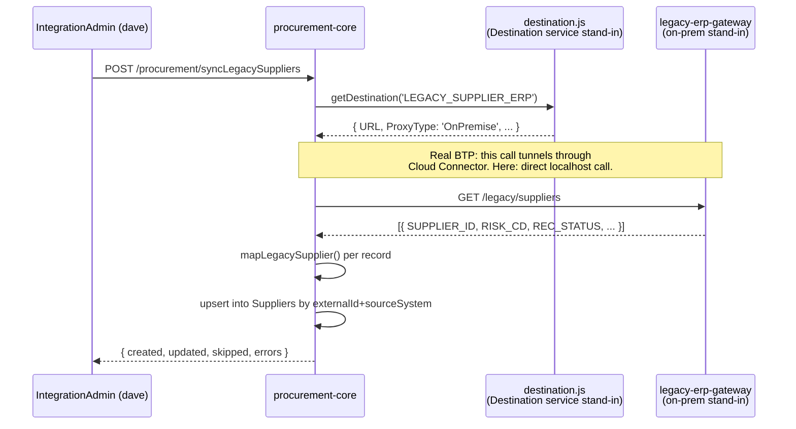

# Connectivity: Destination service, Cloud Connector, and Business Application Studio

Written to close the single starkest gap session 3's research turned up:
SAP's own "Administrating SAP Business Technology Platform" learning journey
names **connectivity via Cloud Connector** as a top-line objective, and this
project had zero on-prem-adjacent story despite the domain's own "legacy
supplier feed" scenario existing since Phase 0. `services/legacy-erp-gateway`
and `procurement-core/srv/lib/destination.js` are the answer.

## The problem this solves

A BTP app almost never talks *only* to other BTP services. Real landscapes
have on-prem systems (an old ERP, a file share, a legacy database) that BTP
apps need to reach — but a BTP app also can't just be handed a VPN into a
customer's data center. SAP's answer is a specific, two-part pattern:

1. **Cloud Connector** — a lightweight agent the customer installs *inside*
   their own network, which opens a secure, outbound-only tunnel to their
   BTP subaccount. Nothing inbound is opened on the customer's firewall.
   Cloud Connector also **whitelists** exactly which internal hosts/ports/
   paths are exposed through the tunnel — not "the whole network," a
   specific allowlist.
2. **Destination service** — a BTP service that stores *named* connection
   configs (a `Destination` has a `Name`, a `URL`, a `ProxyType`, and
   `Authentication` details). App code never hardcodes a target URL; it
   asks the Destination service for a destination **by name** and gets back
   where to actually call and how to authenticate. Two `ProxyType` values
   matter here:
   - `Internet` — call the target directly, it's already reachable
     (a public API, another BTP service).
   - `OnPremise` — route the call through Cloud Connector's tunnel instead.
     The app code doesn't change between these two cases; only the
     destination's configuration does.

## How this project simulates it, and where the seam is

There's no real on-prem network segment or Cloud Connector agent available
on a laptop, so:

- **`services/legacy-erp-gateway`** plays the role of the on-prem system —
  deliberately shaped like a real legacy API (`SUPPLIER_ID`, `RISK_CD`,
  single-letter status codes), not a clean BTP service. See its own README
  for why the field-mapping work this forces is itself real integration
  work, not incidental plumbing.
- **`procurement-core/srv/lib/destinations.json`** plays the role of the
  Destination service's stored configuration — one entry,
  `LEGACY_SUPPLIER_ERP`, with `ProxyType: 'OnPremise'` set even though the
  simulation calls it directly over `localhost`. The `ProxyType` is kept
  accurate to what a real destination would say, not simplified away,
  because it's the field that actually decides Cloud-Connector-or-not in
  production.
- **`procurement-core/srv/lib/destination.js`**'s `getDestination(name)` is
  the seam: it has the exact shape/signature a caller would use against the
  real thing (`@sap-cloud-sdk/connectivity`'s `getDestination()`). Swapping
  the simulation for the real Destination service + Cloud Connector later
  means rewriting this one file's body — every caller
  (`srv/service.js`'s `syncLegacySuppliers` handler) stays unchanged.

## Verified, not just designed

Run against a real second process (`legacy-erp-gateway` on :4007) and a real
`procurement-core` instance: `dave` (mocked `IntegrationAdmin` role) synced
5 legacy records → 5 created; re-running the identical sync → 5 updated, 0
created (idempotent, matched on `externalId`+`sourceSystem`); `alice`
(`Requester` role, wrong role) got a real `403` attempting the same call —
RBAC applies to integration actions exactly like business actions, not a
separate, weaker mechanism.

## SAP Business Application Studio (BAS)

The standard cloud IDE for CAP/Fiori/ABAP Cloud development — a
browser-based VS Code-derived environment with pre-configured "dev spaces"
per project type (Full Stack Cloud Application, SAP Fiori, ABAP Cloud),
each pre-wired with the right CDS/UI5/ABAP tooling and a direct connection
to the target BTP subaccount. This project's local development happened in
a plain local editor against local Node/CDS tooling — functionally
equivalent for CAP development, but worth being explicit about: once
deploying against the real trial account, working from a BAS dev space
(rather than continuing purely locally) is the standard SAP workflow, and
is planned for the account-gated phases of this project rather than
retrofitted here.

## Known limitations (honesty notes)

- No actual Cloud Connector agent exists anywhere in this simulation —
  there is no tunnel to demonstrate, only the destination-lookup contract
  that would drive one. This is a documented simplification, not a claim of
  having built Cloud Connector.
- `destinations.json` is a flat local file, not a real BTP service with its
  own UI, roles, and API — the seam (`getDestination()`) is real, the
  storage isn't.
- Authentication on the simulated destination is `NoAuthentication`; a real
  on-prem destination would almost always carry `BasicAuthentication` or
  `PrincipalPropagation` credentials, which this simulation doesn't need
  since it's calling a service on the same machine.
