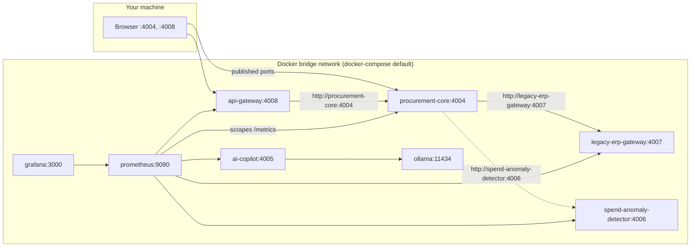
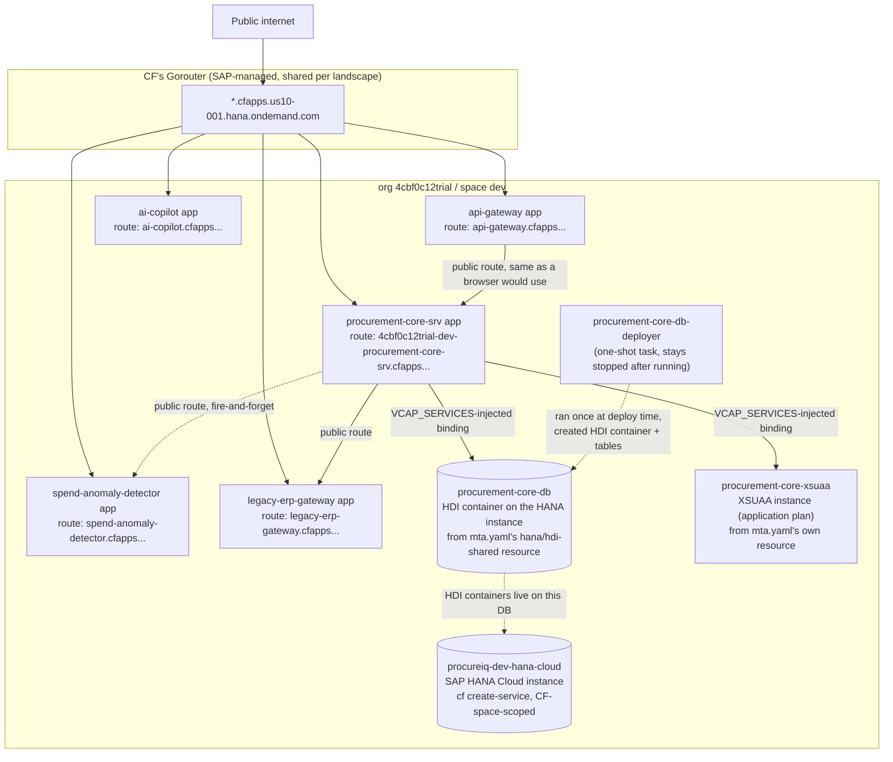
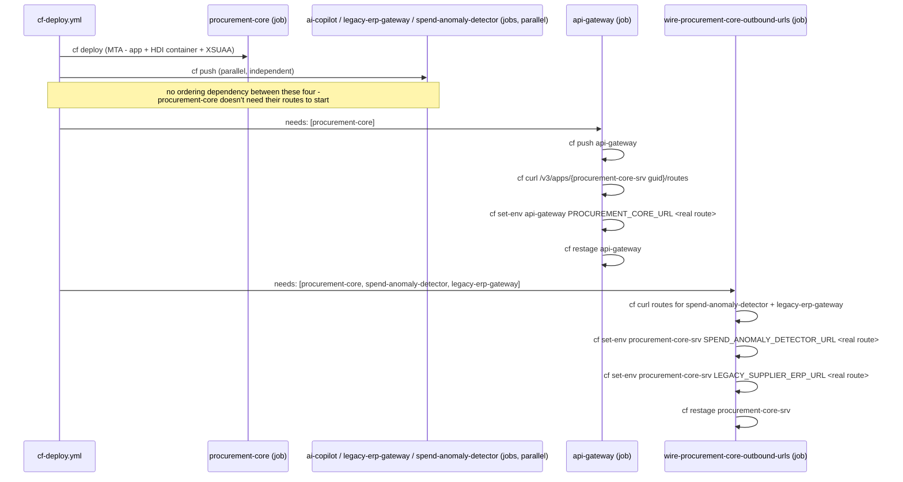
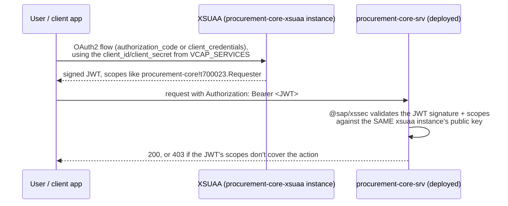
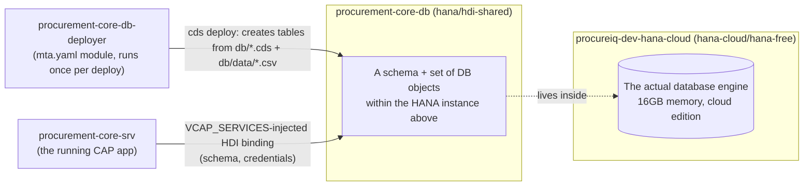

# Networking, connections, and request flow — local vs. deployed

Two genuinely different networks run this same code: Docker Compose's
bridge network locally, and Cloud Foundry's real routing layer on BTP.
This doc covers both, plus the internals in between (XSUAA tokens, HDI
container binding, VCAP_SERVICES) that the code-level README diagrams
don't show.

## 1. Local: Docker Compose's bridge network

Every service in `docker-compose.yml` joins one default bridge network.
Container-to-container calls use the **service name as hostname**
(Compose's built-in DNS) — `procurement-core` calls
`http://legacy-erp-gateway:4007`, not `localhost:4007`, because each
container has its own network namespace; `localhost` inside
`procurement-core`'s container means *that container*, not the host.
This is exactly the class of bug the `<NAME>_URL` env-var override in
`srv/lib/destination.js` exists to fix (see that file's own comment) —
found live, not designed in from the start.

Only ports explicitly published in `docker-compose.yml` (`4004`, `4005`,
`4006`, `4007`, `4008`, `9090`, `3000`, `11434`) are reachable from the
host at all — everything else (e.g. a service calling another by its
Compose name) never leaves the bridge network. There is no auth boundary
here beyond CAP's own mocked users — every container can reach every
other container directly, which is exactly why `api-gateway`'s API-key
layer is a genuinely separate, additive concern, not a substitute for
network isolation.

## 2. Deployed: Cloud Foundry's routing layer on BTP

This is the real, currently-live topology (`org 4cbf0c12trial`,
`space dev`) — not a simulation. Every app below is actually running;
see the root README's "Live on BTP" section for the real URLs.

**The one thing that's genuinely different from local**: `api-gateway`
calling `procurement-core`, and `procurement-core` calling
`legacy-erp-gateway`/`spend-anomaly-detector`, all go out over **public
internet routes** (`*.cfapps.us10-001.hana.ondemand.com`), not a private
network — even though both apps live in the same CF space. This is real
CF behavior on a trial: every app gets a public route by default, and
inter-app calls use those same public routes unless you explicitly set
up **Application Networking** (`cf add-network-policy`, container-to-
container communication over CF's internal `apps.internal` domain,
bypassing Gorouter). This project doesn't use container-to-container
networking — a real, honest gap, not hidden: every "internal" call in
this deployed landscape is actually a public HTTPS call to another
app's public route. See [Known limitations](#known-limitations) below
for what that means and how you'd close it for real.

### How a route actually gets wired: `cf-deploy.yml`'s job graph

The CF routes above don't self-assemble — `.github/workflows/cf-deploy.yml`
wires them explicitly, in dependency order, because each app needs to
know another app's *route* (a value CF only assigns once that app is
pushed):

This is the exact same `<NAME>_URL` env-var override mechanism
`srv/lib/destination.js`/`srv/lib/events.js` already use for Docker
Compose — the CF deploy pipeline just supplies real CF routes instead of
Compose service names as the override value. One seam, two environments.

## 3. XSUAA: the token flow this project's local mocked-auth stands in for

Locally, CAP's own `cds.requires.auth.users` mocked-auth strategy checks
a username against a fixed list and accepts any password — see the root
README's "Testing and navigating it" section. Deployed, `procurement-core`
has a real `procurement-core-xsuaa` XSUAA service instance
(`application` plan, from `mta.yaml`), bound to the app via
`VCAP_SERVICES` at push time — this is what a real OAuth2/JWT flow into
this app would look like:

The real, dynamically-assigned identity for this specific deployment is
`procurement-core!t700023` (confirmed live — see
`infra/terraform/variables.tf`'s `xsuaa_xsappname` and
`infra/terraform/README.md`'s "XSUAA: real two-phase apply" section for
exactly how that value was fetched and wired into the three role
collections). Every scope reference in `xs-security.json`
(`$XSAPPNAME.Requester`, etc.) resolves through this identity — it's
what turns a role-template name into a real, checkable OAuth scope.

**A real conflict found and fixed this session, worth understanding**:
Terraform originally *also* created a second, subaccount-level XSUAA
instance under the identical `xsappname` (`procurement-core`), to let
`role_collections` learn the real xsappname in one apply. Two
`application`-plan XSUAA instances registering the same xsappname
genuinely conflict at the broker level — every real deploy of
`procurement-core-xsuaa` failed with an internal NPE
(`ScaleOutLandscapeImpl.getEndpoints()`, `scaleOutLandscape` null) for as
long as that duplicate existed, and stopped the moment it was destroyed.
See `infra/terraform/README.md` for the full story and the corrected,
real two-phase design.

## 4. HANA Cloud: the database binding this project's local SQLite stands in for

Locally, `procurement-core`'s Dockerfile runs `cds-deploy` against
SQLite at *build* time — no separate database process at all. Deployed,
the same CDS model targets a real **HDI container**
(`procurement-core-db`, `hana`/`hdi-shared` plan) sitting on a real
**HANA Cloud database instance** (`procureiq-dev-hana-cloud`,
`hana-cloud`/`hana-free` plan) — two separate, real BTP resources, not
one:

**A real scoping bug found and fixed this session, worth understanding**:
`hana`/`hdi-shared`'s broker provisions a container *on an existing
database* — it does not create one. The database itself
(`procureiq-dev-hana-cloud`) has to exist first, as its own resource,
and — this is the part that cost real debugging time — it has to be
**CF-space-scoped**, not just present somewhere in the subaccount.
Terraform's `SAP/btp` provider can only create **Service-Manager
(subaccount)-scoped** instances (checked exhaustively against the real
provider schema — no CF-space/platform concept exists in it at all), so
it's created directly via `cf create-service` inside
`cf-deploy.yml`'s `procurement-core` job instead. See
`infra/terraform/README.md`'s "HANA Cloud: why this isn't
Terraform-managed" section for the full real-error trail and the exact
`cf create-service` parameters (queried live from the plan's own
published JSON Schema, not guessed).

## 5. Component quick-reference (deployed)

| Component | CF resource type | Created by | Scope |
|---|---|---|---|
| `api-gateway`, `ai-copilot`, `legacy-erp-gateway`, `spend-anomaly-detector` | CF app (`cf push`) | `cf-deploy.yml` | space |
| `procurement-core-srv`, `procurement-core-db-deployer` | CF apps (MTA modules) | `cf-deploy.yml`'s `cf deploy` | space |
| `procurement-core-db` | Service instance (`hana`/`hdi-shared`) | `mta.yaml`'s own resource, created by `cf deploy` | space |
| `procurement-core-xsuaa` | Service instance (`xsuaa`/`application`) | `mta.yaml`'s own resource, created by `cf deploy` | space |
| `procureiq-dev-hana-cloud` | Service instance (`hana-cloud`/`hana-free`) | `cf create-service` step in `cf-deploy.yml` | space |
| CF org `4cbf0c12trial` | Cloud Foundry environment instance | SAP (trial default), adopted by `infra/terraform/modules/cloudfoundry-env` | subaccount |
| CF space `dev` | Space within the org | SAP (trial default) | org |

## Known limitations

- **No Application Networking / private routing.** All inter-app calls
  go over public `*.cfapps.us10-001.hana.ondemand.com` routes, not
  `apps.internal`. This is honest, not hidden — a real production
  landscape would run `cf add-network-policy <source-app> <dest-app>
  --protocol tcp --port <port>` per pair and switch each `<NAME>_URL`
  override to the app's internal route, closing the public-route
  exposure for calls that never need to leave the space. Not done here
  because the public routes already demonstrate the same integration
  pattern (`<NAME>_URL` override, real HTTP, real failure handling) at
  zero extra setup, and this trial's apps are meant to be reachable
  directly for evaluation anyway (see the root README's "Live on BTP").
- **No API Management / real API gateway product in front of `api-gateway`.**
  `api-gateway` is this project's own Express app playing that role
  (API keys, rate limiting) — see the root README's "What mirrors what"
  table for what it stands in for.
- **XSUAA scopes aren't exercised by a real external client, and this
  now genuinely blocks live testing of `/procurement/*`.** The role
  collections and scopes are real and correctly wired (confirmed via
  Terraform's second-phase apply adopting them), but no actual OAuth2
  client has been run through the flow in section 3 above yet — locally
  tested via CAP's mocked auth instead. Confirmed directly against the
  live deployment: neither an unauthenticated call, CAP's local
  mocked-auth credentials (`bob:x`, etc. — dev-profile-only, meaningless
  against a real XSUAA instance), nor a call routed through
  `api-gateway` with a real API key gets past the deployed instance's
  `401`. A genuine end-to-end token test (e.g. via `cf ssh` + `curl`
  with a real client-credentials grant) is the concrete next step to
  actually exercise the requisition→approval→PO workflow live over
  HTTP, not yet done.
- **No live browser UI on the deployed instance.**
  `procurement-core`'s Fiori Elements preview (`/$fiori-preview/...`,
  the one section 1's local walkthrough uses) 404s when deployed —
  confirmed directly. It's generated by `cds-dk` at dev/watch time; the
  production build this app actually deploys with (`cds-deploy`, no
  dev-time tooling bundled) doesn't include it. Testing the live
  deployment today means calling endpoints directly — see the root
  README's "Live on BTP" section for the real, currently-working list.
