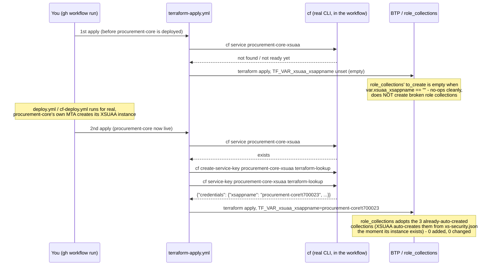

# infra/terraform

Provisions the ProcureIQ landing zone on the real BTP trial subaccount.
**Applied for real, live.** Every module below has run a real `apply`
against the actual trial subaccount (org `4cbf0c12trial`, subaccount
`e40cb8d7-82ad-4851-a323-12751a62402e`) through GitHub Actions, not from
a local machine — see "Why GitHub Actions, not local apply" below. All
5 application services are also deployed and live on top of this
landing zone — see the root README's "Live on BTP" section for the real
URLs, and `docs/operations/networking-and-request-flow.md` for exactly
what each piece below is actually used for at runtime.

## Structure — corrected to match a real, working convention

```
infra/terraform/
├── main.tf, variables.tf, outputs.tf,     # ONE shared root module - every
│   provider.tf, versions.tf                environment uses these unchanged
├── modules/                               # reusable, no environment-specific values
│   ├── subaccount/         (data lookup - a trial can't create a second one)
│   ├── entitlements/        (for_each over a list, real pattern from SAP-samples)
│   ├── cloudfoundry-env/
│   ├── kyma-env/              (gated off - var.kyma_enabled, see below)
│   ├── hana-cloud/             (gated off - count=0, see "HANA Cloud" below)
│   ├── xsuaa/                (gated off - count=0, see "XSUAA" below)
│   ├── role-collections/     (real two-phase apply - reads var.xsuaa_xsappname)
│   └── destination/          (Cloud Connector counterpart, not yet instantiated)
└── environments/
    ├── dev/terraform.tfvars    # ONLY variable values - real, usable today
    ├── qa/terraform.tfvars     # ONLY variable values - stub, no qa subaccount exists yet
    └── prod/terraform.tfvars   # ONLY variable values - same reason
```

**This was corrected from an earlier, wrong structure** that duplicated
`main.tf`/`variables.tf`/`outputs.tf`/`provider.tf`/`versions.tf` inside
each `environments/<env>/` directory — meaning every environment would
have needed its own copy of the same module-composition logic, drifting
out of sync over time. Fixed to mirror the real, working pattern from
`sm-infraforge/langfuse` (checked directly, not assumed): one shared root
module, environment folders holding *only* a `terraform.tfvars`.

## State isolation: one shared config, one HCP Terraform workspace per environment

`versions.tf`'s `cloud {}` block is deliberately empty — `organization`
and `workspaces.name` come from the `TF_CLOUD_ORGANIZATION` and
`TF_WORKSPACE` environment variables instead (confirmed against
HashiCorp's own docs: when a `cloud` block argument is omitted, Terraform
reads the matching env var; the workspace must already exist). CI sets
these per job, so the exact same `.tf` files serve every environment.

Worth being explicit about since it doesn't map 1:1 onto the reference
project's S3-backend pattern: **HCP Terraform's state-isolation unit is a
workspace**, not a key inside one shared workspace the way S3 works —
there's no "one workspace, many key-namespaced state files" option in HCP
Terraform. So `dev`/`qa`/`prod` become **three separate HCP Terraform
workspaces** — `procureiq-dev`, `procureiq-qa`, `procureiq-prod` — each
with its own state. `procureiq` is the project-name prefix (the same role
`PROJECT` plays in the reference project's Jenkinsfile), `-<env>` is the
per-environment suffix. You need to create each workspace in HCP Terraform
up front (just `dev` for now is fine — add `qa`/`prod` when there's a
real landscape to point them at).

**Each workspace's Execution Mode must be "Local"** — this means HCP
Terraform only stores state; GitHub Actions runs the actual `plan`/
`apply`. One consequence worth knowing before it's confusing: **Local-
execution-mode workspaces don't have a Variables tab at all** — HCP
Terraform doesn't evaluate workspace variables for local runs. Credentials
have to reach the Terraform CLI directly as `TF_VAR_*` environment
variables from wherever the CLI actually runs (GitHub Actions) — see the
next section.

## Why GitHub Actions, not local `apply`

Applying Terraform from a laptop against infrastructure a public GitHub
repo's CI is also meant to manage invites exactly the kind of drift and
untracked-changes problems Terraform exists to prevent — the state of
truth should be "what the last CI run applied," not "whatever was last run
locally, maybe by someone else's laptop." `.github/workflows/terraform-
plan.yml` and `terraform-apply.yml` (repo root — GitHub only discovers
workflows there) run `plan` on every PR touching `infra/terraform/**` and
`apply` only on an explicit manual trigger against the `dev`
GitHub Environment (which can require reviewer approval) — never
automatically on push, matching this project's "deploy after review"
instruction.

## Before the first `terraform plan` — GitHub Actions secrets needed

All five set on the GitHub repo (Settings → Secrets and variables →
Actions), never in a committed file:

| Secret | Value |
|---|---|
| `TF_API_TOKEN` | An HCP Terraform API token (User Settings → Tokens) |
| `TF_CLOUD_ORGANIZATION` | Your HCP Terraform org name (e.g. `vishalrath0d-tf-org`) |
| `BTP_USERNAME` | SAP Universal ID used to log into the BTP trial |
| `BTP_PASSWORD` | Its password |

Plus, in HCP Terraform itself: create the `procureiq-dev` workspace via
the **CLI-Driven Workflow** (not "Version control" — that would have HCP
Terraform trigger its own runs from the repo, duplicating what GitHub
Actions already does; not "API-Driven" either, since the CLI via
`hashicorp/setup-terraform` is what's actually driving this), then set
its **Execution Mode to Local** in Settings → General.

Also confirm the subaccount's exact region and global account subdomain
in the BTP cockpit; update `environments/dev/terraform.tfvars` if they
differ from what's there.

## XSUAA — gated off in Terraform, real two-phase apply for role collections

`module.xsuaa` is gated to `count = 0` in `main.tf` — it once created a
subaccount-level XSUAA `application`-plan instance, and that instance is
now understood to be a genuine conflict, not a convenience.

**What actually happened, live**: an earlier version of this module read
the real xsappname directly from `module.xsuaa.credentials` within the
same apply (a resource *attribute*, not `for_each`/`count`, can validly
depend on another resource created in the same run — completely
standard Terraform). That worked at the *plan* level. It broke at the
*deploy* level: `procurement-core`'s own MTA (`mta.yaml`) declares its
**own** XSUAA `application`-plan resource, using the identical
`xs-security.json` and therefore the identical `xsappname`
(`procurement-core`). Two `application`-plan XSUAA instances registered
under the same xsappname genuinely conflict at the broker level — every
real `cf deploy` of `procurement-core` failed creating
`procurement-core-xsuaa` with an internal broker NPE
(`Cannot invoke "com.sap.xs2.security.scaleout.ScaleOutLandscapeImpl.
getEndpoints()" because "scaleOutLandscape" is null`), and that error
stopped reproducing the moment the Terraform-managed duplicate was
destroyed (`terraform apply` after gating `module.xsuaa` to 0, confirmed
via a clean `cf deploy` immediately after).

**The fix, restoring what this module's own comment says it used to do
before the same-apply redesign**: `role_collections` now takes a plain
`xsuaa_xsappname` string variable (`var.xsuaa_xsappname`, default `""`,
see `variables.tf`) instead of decoding it from a Terraform-managed
instance's credentials. This makes the apply genuinely two-phase again,
by design:



Confirmed live, exactly this sequence: `terraform-apply.yml`'s "Fetch
the real xsappname" step correctly returned empty on the first run
(before a successful deploy existed), and correctly fetched
`procurement-core!t700023` on the second run (after `procurement-core`
deployed successfully) — `terraform apply` then reported
`0 added, 0 changed, 0 destroyed` for the role collections, because
XSUAA had already auto-created all three (`creationType: XSSECURITY`)
from `xs-security.json`'s own inline declaration the moment its real
instance was created — this module's adaptive lookup (below) correctly
adopted them rather than trying to create duplicates.

`module.xsuaa`'s code is kept, not deleted — same convention as
`modules/kyma-env`/`modules/hana-cloud` below — it's correct Terraform
for a genuinely subaccount-level XSUAA instance, just not one that
should coexist with an MTA that creates its own.

## HANA Cloud — why this isn't Terraform-managed either

`module.hana_cloud` is also gated to `count = 0`, for a different reason
than XSUAA: **it's the wrong scope, not a conflict**.

`procurement-core`'s HDI container (`procurement-core-db`, `hana`/
`hdi-shared` plan, from `mta.yaml`) needs an *existing* HANA Cloud
database to attach to — `hdi-shared` provisions a container on a
database, it doesn't create the database itself (confirmed straight from
the marketplace plan's own description: "Manage schemas and HDI
containers on an existing SAP HANA database"). This trial has no
pre-provisioned database, so one has to be created as its own resource
first.

Terraform's `btp_subaccount_service_instance` resource creates a
**Service-Manager/subaccount-scoped** instance. The `hana`/`hdi-shared`
broker specifically needs a database visible **to the CF space** — real
error, hit live: `Can not create service instance 'procurement-core-db':
There is no database available. Ensure that you have a database
available in space 'dev' within organization '4cbf0c12trial'`. Confirmed
two ways, not assumed: `cf curl /v3/service_instances?names=procureiq-
dev-hana-cloud` returned zero results in the `dev` space for the
Terraform-created instance, and the BTP cockpit's own **Space → Service
Instances** view never listed it either — only a `cf create-service`
instance, created directly against that space, showed up there
correctly scoped.

**Checked exhaustively before concluding Terraform genuinely can't do
this** — every `resource_schemas` and `data_source_schemas` key in the
real, downloaded `SAP/btp` v1.26.0 provider schema, not a guess: no
platform/CF-space-scoping mechanism exists anywhere in it.
`btp_subaccount_service_instance`'s `platform_id` attribute is
`computed`-only, not settable. CF-space-scoped resources are the domain
of the separate `cloudfoundry/cloudfoundry` Terraform provider, not
`SAP/btp` — not adding a second provider for one resource.

**The real fix**: `cf-deploy.yml`'s `procurement-core` job creates the
database directly, idempotently, before the MTA deploy that needs it:

```bash
cf create-service hana-cloud hana-free procureiq-dev-hana-cloud \
  -c '{"data":{"memory":16,"edition":"cloud","generateSystemPassword":true}}' \
  --wait
```

The `-c` parameters came from the plan's own **published create schema**
(`cf curl /v3/service_plans/<hana-free guid>` →
`.schemas.service_instance.create.parameters`), queried live, not
guessed — after two real failed attempts confirmed guessing was
actually wrong here: an omitted `parameters` field and an explicit `"{}"`
both hit `Failed to unmarshal parameters: unexpected end of JSON input`
(the broker genuinely requires a populated object, not merely valid
JSON), and even `{data: {edition, memory}}` — the schema's own stated
`required` fields — still failed with `invalid Parameter
(systempassword): Required for HANA creation`, a runtime-only
requirement the published schema's `required` array didn't capture.
`generateSystemPassword: true` is the documented way to satisfy that
without this project generating/storing a HANA system password itself.

`modules/hana-cloud`'s code is kept, not deleted, same convention as
`modules/kyma-env`/`modules/xsuaa` — genuinely correct Terraform for a
subaccount-wide HANA Cloud instance (e.g. if this project later needed
one instance shared across services in different spaces), just not the
shape this specific broker needed here.

## Cockpit equivalent, module by module

See `docs/concepts/15-terraform-vs-cockpit.md` for the general "why
IaC at all" reasoning and `docs/operations/btp-cockpit-navigation.md`
for a screen-by-screen map. This table is the concrete per-module
mapping for exactly what's in this repo:

| Module | What it creates | Cockpit equivalent |
|---|---|---|
| `modules/subaccount` | *(data lookup only — a trial can't create a second subaccount)* | Global account → Create Subaccount |
| `modules/entitlements` | `btp_subaccount_entitlement` × 5 (adopts pre-granted ones on this trial) | Subaccount → Entitlements → Configure Entitlements → Add Service Plans |
| `modules/cloudfoundry-env` | `btp_subaccount_environment_instance` (adopts the trial's pre-existing org) | Subaccount → Cloud Foundry → Enable Cloud Foundry (fresh account only — a trial already has one) |
| `modules/kyma-env` (gated off, `kyma_enabled=false`) | `btp_subaccount_environment_instance` (Kyma) | Subaccount → Kyma Environment → Enable — **blocked on this trial regardless of path**, see "Known limitations" below |
| `modules/xsuaa` (gated off, `count=0`) | `btp_subaccount_service_instance` + `btp_subaccount_service_binding` | Subaccount → Instances and Subscriptions → Create → `xsuaa`/`application` — **not recommended alongside an MTA that creates its own**, see "XSUAA" above |
| `modules/role-collections` | `btp_subaccount_role_collection` × 3 (adopts XSUAA's auto-created ones) | Subaccount → Security → Role Collections → Create Role Collection |
| `modules/hana-cloud` (gated off, `count=0`) | `btp_subaccount_service_instance` (subaccount-scoped) | Subaccount → Instances and Subscriptions → Create → `hana-cloud` — **wrong scope for an HDI container's database, see "HANA Cloud" above; the real one was created via `cf create-service`/Service Marketplace instead** |
| *(not Terraform-managed)* `procureiq-dev-hana-cloud` | `cf create-service` in `cf-deploy.yml` | Space → Service Marketplace → `hana-cloud` → Create |
| *(not Terraform-managed)* `procurement-core-db`, `procurement-core-xsuaa` | `cf deploy` (MTA resources in `services/procurement-core/mta.yaml`) | Space → Service Marketplace, one instance per resource — but doing this by hand would desync from the MTA's own tracked deployment state; `cf deploy`/`cf undeploy` is the correct tool here, not the cockpit |

## What's verified vs. what needs a live account to verify

Every resource/attribute name in every module was checked against the
actual downloaded `SAP/btp` provider v1.26.0 schema, not written from
memory. `terraform init -backend=false && terraform validate` passes
(the `-backend=false` skips the backend template's incomplete
`organization`/`workspaces.name`, which need real CI-supplied values to
resolve, while still fully type-checking every module).

**Update — verified live**: a real `terraform plan` against the actual
HCP Terraform workspace and BTP trial credentials ran clean
(`Plan: 6 to add, 0 to change, 0 to destroy`) after fixing several real
issues a schema-only validate couldn't catch — see git history on the
`terraform/first-plan-run` branch/PR for the full sequence:
`data.btp_subaccount` needs `region` alongside `subdomain` (not just
`subdomain` — the schema marks both individually optional, the API
requires both together); the real subaccount/global-account subdomains
differed from what was assumed (`4cbf0c12trial` vs. `4cbf0c12trial-ga` —
confirmed directly in the cockpit, not guessed twice); the trial's
default Cloud Foundry org **cannot be deleted** (`cf delete-org` →
"not authorized"), so `modules/cloudfoundry-env` and `modules/kyma-env`
now look up what's already provisioned and only create what's actually
missing (`count = exists ? 0 : 1`) — the same module works correctly on
this trial (adopts CF, creates Kyma, since Kyma is confirmed not yet
enabled) and on a fresh/real subaccount (creates both); `depends_on` on a
module forces its data sources to defer to apply-time, which breaks
`count` evaluation — removed, with the real practical implication
documented (a genuinely fresh subaccount with zero entitlements might
need two applies the first time, same class of issue as any resource
whose count depends on another resource's existence).

**Correction to the paragraph above, from a real `terraform apply` run**:
"the live plan proposed creating them without error" was **not** the same
as "confirmed correct" — `terraform plan` never validates entitlement
`service_name`/`plan_name` against the live catalog, only `apply` does,
and the first real `apply` proved several of these wrong: `cloudfoundry/
standard` and `hana-cloud-trial/hana-cloud-trial` both failed with *"the
global account is not entitled to this service plan"* (this global
account's real entitlement for each is a different plan name, or already
pre-granted through a different mechanism entirely — not yet confirmed
which); `kymaruntime/trial` failed separately with *"a quota was not set
in the amount parameter"* — a config gap, not a wrong name (its
entitlement `category` is `SERVICE`, which requires an explicit numeric
`amount`; fixed in `main.tf`).

The real, more useful fix wasn't guessing better names — it was
recognizing that a trial account's default entitlements are typically
**already pre-granted automatically**, so Terraform trying to *create* a
fresh entitlement for something already granted is the wrong operation,
independent of whether the guessed name happens to be right. `modules/
entitlements` is now adaptive, same pattern as `cloudfoundry-env`/
`kyma-env`: look up what's already entitled (`data
"btp_subaccount_entitlements"`), only create what's genuinely missing.
This is correct on a trial (silently adopts the pre-granted ones,
whatever their real plan name is) and correct on a real/paid account
(nothing is pre-granted, so it creates everything) — the same code, not
two different code paths for the two account types.

`modules/role-collections` needed the identical fix for a different
reason: XSUAA auto-creates a role collection (`creationType: XSSECURITY`)
for every role template in `xs-security.json` the moment its service
instance is created — by the time this module tried to create the same
three role collections fresh, they already existed, and the API refused
to change their `creationType` to `admin`. Now adaptive too (`data
"btp_subaccount_role_collections"`), with one honestly-stated residual
edge case: on a genuinely fresh subaccount where XSUAA and these role
collections are *both* created for the first time in the same apply, the
very first run might still hit this once (the lookup's plan-time snapshot
predates XSUAA's auto-creation) — re-running `apply` a second time
resolves it, the same class of "fresh subaccount might need two applies"
note already given above for entitlements-then-environments.

**Resolved**: `abap`/`integration-suite` turned out to be a naming
problem too, not a real "not entitled" rejection — `btp list accounts/
entitlement --subaccount <id>` (real command output, not guessed) showed
both are already granted, just under different real names:
`abap-trial`/`shared` and `integrationsuite-trial`/`trial` (confirmed
against the cockpit's Entitlements → Add Service Plans catalog too — both
show `100%` already assigned). Same for `cloudfoundry` (real:
`cloudfoundry`/`trial`, not `standard`) and the HANA entitlement (real:
`hana`/`hdi-shared`, quota 10 — `hana-cloud-trial` isn't a real
entitlement name at all; `procurement-core/mta.yaml`'s HDI container
resource had the identical wrong name and was fixed at the same time,
before it could fail a real `cf deploy` later). `main.tf`'s
`entitlements` module call now uses all five real, live-confirmed values
— the next `terraform plan`/`apply` should show every entitlement
adopted (0 created), with only the Kyma environment instance itself
genuinely needing to be (re-)created.

## Known limitations (honesty notes)

- No genuinely separate `qa`/`prod` subaccounts yet — the trial only
  provides one. Real multi-env promotion needs a paid landscape.
- **This trial account has no self-service Kyma provisioning at all,
  through any path** — confirmed twice over: two real, consecutive
  `CREATION_FAILED` `terraform apply` failures (both in ~40s, too fast to
  be real provisioning), then the identical failure trying the cockpit's
  own native "Enable Kyma" wizard directly (not Terraform). SAP's real
  documentation ("Getting Started with a Trial Kyma Instance," fetched via
  SAP-docs' GitHub mirror since the live Help Portal page is JS-rendered)
  confirms this is by design: a trial Kyma instance must be **requested
  from SAP** — a support ticket for component `BC-CP-XF-KYMA`, or an email
  to `kyma@sap.com` (subject `SAP BTP, Kyma Runtime Trial Request`,
  including Global Account ID, Subaccount ID, administrator emails, and a
  reason) — reviewed "on a case-by-case basis within one month," not
  guaranteed. Not fixable from Terraform or any code in this repo — a
  genuinely account-side, human-approval-gated step. `modules/kyma-env`'s
  adaptive lookup will correctly adopt the cluster once SAP eventually
  provisions it, no code change needed for that half. Everything else in
  this project (CF, XSUAA, role collections, all 5 entitlements) is fully
  live-verified and unaffected by this — only the Kyma cluster itself, and
  by extension `spend-anomaly-detector`'s real deployed testing, is
  blocked pending SAP's approval. Also confirmed in SAP's docs while
  chasing this down: once approved and provisioned, a trial Kyma cluster
  auto-expires and is deleted 14 days later — not a one-time setup.
- Kyma provisioning, once SAP approves the request above, genuinely takes
  15-25 minutes to actually finish; expect to wait there when it happens.
- **While waiting on that approval, `spend-anomaly-detector` (its
  natural home is Kyma — see the root README's architecture diagram)
  is temporarily deployed to CF instead**, via `cf-deploy.yml`, so all
  5 services are live somewhere rather than 4 of 5. See that service's
  own README and `docs/next/next.md` for the flip-back plan once Kyma is
  approved.
- **Two more real, live-only bugs worth knowing if you're replicating
  this on your own trial**: this trial's actual CF org is a
  SAP-assigned name (`4cbf0c12trial`), not a name this project chose —
  `terraform plan`/`apply` never surfaces this, only a real `cf`
  command against the org does. And its real API endpoint is
  `api.cf.us10-001.hana.ondemand.com` — note the `-001` regional-cell
  suffix; the more generic-looking `api.cf.us10.hana.ondemand.com`
  authenticates successfully (same SAP Universal ID) but genuinely
  cannot see this org's resources, which reads as a confusing
  "Organization not found" rather than an auth failure. Both are
  hardcoded, correctly, in `.github/workflows/cf-deploy.yml`/
  `piper-cf-deploy.yml`/`Jenkinsfile.cf` and `terraform-apply.yml`'s
  xsappname-fetch step — update all of them together if this ever moves
  to a different account.
- The adaptive CF/Kyma modules have only been proven against *this*
  trial's actual state (CF pre-existing, Kyma not) — the "creates on a
  fresh subaccount" half of the claim is architecturally sound and
  follows directly from how the lookup/count logic works, but hasn't
  been run against a genuinely empty subaccount to observe the create
  path fire for real.
