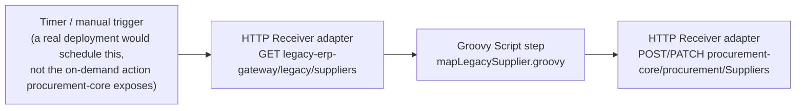

# integration-flow — SAP Integration Suite (Cloud Integration)

The genuinely cloud-only piece of this project's connectivity story:
where the legacy-supplier mapping this project already runs locally
(`procurement-core`'s `syncLegacySuppliers` action +
`srv/lib/legacy-supplier-mapper.js`) would actually live in a real SAP
landscape — as an **iFlow** in SAP Integration Suite's Cloud Integration
capability, not as code embedded in the CAP application itself.

## Why this exists as a separate artifact, not just more `procurement-core` code

Keeping integration logic (calling an external system, transforming its
payload shape) *inside* the application that owns the domain model is a
real, common anti-pattern this project's own `procurement-core` currently
takes on purpose, for a good reason: **there is no local, headless
authoring tool for iFlows** — Integration Suite's Cloud Integration
designer is a web application, the same real constraint
`PROJECT_CHARTER.md`'s "ABAP Environment and Integration Suite" section
documents for `services/supplier-master-abap`. `procurement-core`'s
in-app version is this project's honest, locally-testable simulation of
what this iFlow does; **this folder is the real target architecture**,
written as real deployable artifacts, not runnable end-to-end without a
live Integration Suite tenant to import them into.

## What's here, and what's genuinely verified vs. not

| File | What it is | Verified? |
|---|---|---|
| `src/main/resources/script/mapLegacySupplier.groovy` | The actual transformation — legacy field names (`SUPPLIER_ID`, `CTRY_CD`, `RISK_CD`, ...) to ProcureIQ's clean domain shape | **Logic verified**: a 1:1 port of `procurement-core/srv/lib/legacy-supplier-mapper.js`'s already-tested mapping (same `RISK_MAP`/`STATUS_MAP`, same field names, same error cases) — not independently unit-tested in Groovy itself (no local Groovy runtime in this environment to run it against), but the mapping *decisions* it encodes are the same ones proven correct by that file's own real Jest tests. |
| `src/main/resources/scenarioflows/integrationflow/LegacySupplierSync.iflw` | The actual iFlow: HTTPS sender → call the legacy system → Groovy script step → HTTPS receiver into `procurement-core`'s OData service | Real BPMN2 XML, structured against a real, publicly committed `.iflw` file (verified namespaces, `ifl:property` key/value shape for a Script step, start/end event shape) — not independently validated by importing it into a live Integration Suite tenant, since none exists yet for this project. Treat this as "should import cleanly, not yet confirmed live" the same honesty level `infra/terraform`'s candidate entitlements carry until their own live-verified apply. |
| `META-INF/MANIFEST.MF` | The OSGi bundle manifest every Integration Suite package needs | Standard, low-risk format — the one part of this artifact genuinely low-risk to get right without live verification. |

## The flow, concretely

This is the same sync `syncLegacySuppliers` performs locally, moved
upstream of `procurement-core` entirely — the CAP service would no longer
know or care that a legacy system exists at all once this iFlow is real;
it would just receive already-clean `Supplier` records via its own OData
API, the same way any other client creates one.

## Not yet done (genuinely account-gated, same reasoning as ABAP RAP)

- Importing this package into a live Integration Suite tenant (via the
  Cloud Integration designer's "Import" or a real CI/CD deploy through
  the Integration Suite's own Content Agent) — needs the `integration-suite`
  entitlement `infra/terraform` now provisions as a candidate (see
  `PROJECT_CHARTER.md`), applied and reviewed first.
- Configuring real HTTP adapter credentials/endpoints once
  `legacy-erp-gateway`/`procurement-core` have real deployed CF routes —
  this `.iflw`'s adapter configs currently point at placeholder URLs,
  clearly marked, not real deployed ones (which don't exist yet either).
- A `tmsUpload`-style promotion of this package through
  `transport/cloud-transport-management`, once that's real.
