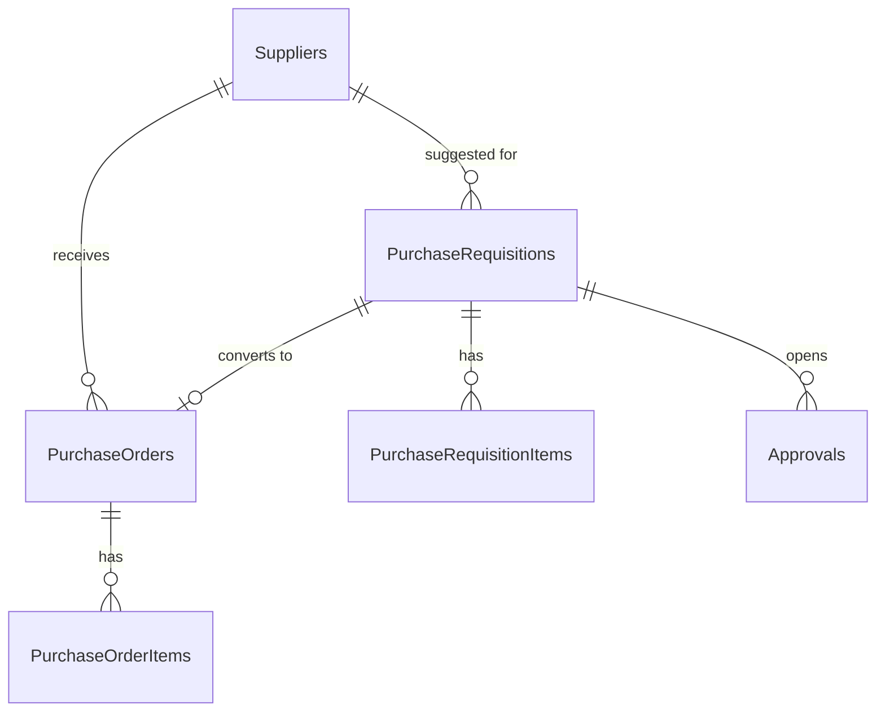
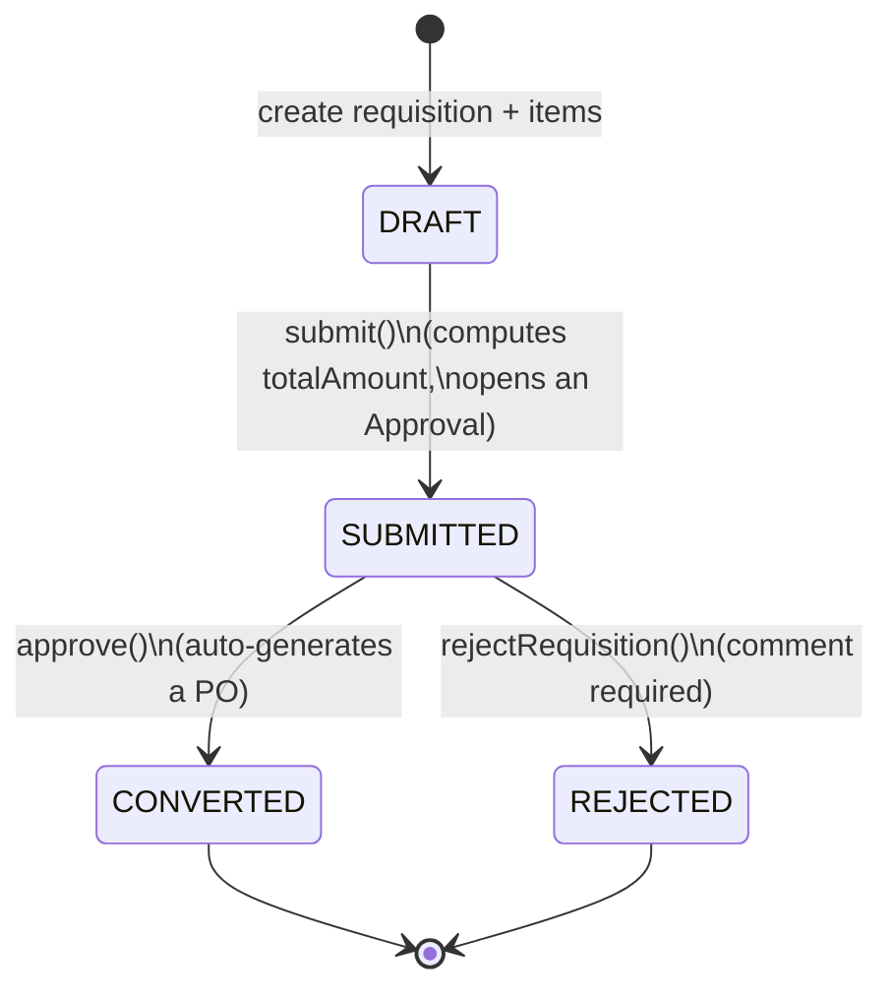

# procurement-core

A CAP (SAP Cloud Application Programming Model) Node.js service implementing the
core of the ProcureIQ domain: **Purchase Requisition → Approval → Purchase Order**.
This is the first service in `sap-btp-platform-engineering` — see the repo root
`PROJECT_CHARTER.md` for how it fits the bigger picture.

Runs entirely locally right now (SQLite), with zero dependency on a BTP account.
Cloud Foundry/HANA Cloud/XSUAA deployment is a later phase — see the charter's
roadmap.

## The domain model



## The lifecycle this service actually enforces



Approver routing is a flat threshold table (`srv/lib/approval-rules.js`), decided
once at `submit()` time from the requisition's computed total — not re-evaluated
later, matching how a real approval-of-record works:

| Total amount | Approver role |
|---|---|
| ≤ 10,000 | MANAGER |
| ≤ 50,000 | DIRECTOR |
| above | CFO |

`approve()` doesn't just flip a status — it copies every requisition item into a
brand-new `PurchaseOrders`/`PurchaseOrderItems` pair, so a PO can always be traced
back to the requisition and approval that produced it. Nothing creates a
`PurchaseOrder` any other way; there's no direct-insert path for POs in the
service definition (`Suppliers`, `PurchaseOrders`, `PurchaseOrderItems` are all
`@readonly` projections).

## Run it locally

```bash
npm install
npx cds deploy      # creates db.sqlite and loads db/data/*.csv
npx cds-serve        # or: npm run watch (auto-restarts on change)
# service is now at http://localhost:4004/procurement
```

Local dev uses CAP's built-in **mocked auth** (`package.json` → `cds.requires.auth`),
so there's no XSUAA/BTP dependency yet — three users are pre-defined:

| User | Roles |
|---|---|
| `alice` | Requester |
| `bob` | Approver |
| `carol` | Requester + Approver |

Any password works locally (mocked auth ignores it) — e.g. `curl -u alice: ...`.

### Try the actual workflow

```bash
# submit the seeded DRAFT requisition (PR-00003)
curl -u alice: -X POST \
  'http://localhost:4004/procurement/PurchaseRequisitions(20000000-0000-0000-0000-000000000003)/ProcurementService.submit' \
  -H 'Content-Type: application/json' -d '{}'

# approve the seeded SUBMITTED requisition (PR-00002) — generates a PO
curl -u bob: -X POST \
  'http://localhost:4004/procurement/PurchaseRequisitions(20000000-0000-0000-0000-000000000002)/ProcurementService.approve' \
  -H 'Content-Type: application/json' -d '{"comment":"Approved within budget"}'
```

### The UI: SAP Fiori Elements, generated from annotations

`srv/service-ui.cds` adds standard SAP Fiori Elements annotations
(`UI.LineItem`, `UI.HeaderInfo`, `UI.SelectionFields`, `UI.Facets`) to the
service — kept in its own file, separate from the API contract in
`service.cds`, which is the normal CAP convention once a project has real UI
annotations. This generates a full List Report + Object Page UI with **zero
hand-written HTML/JS**, served locally at:

```
http://localhost:4004/$fiori-preview/ProcurementService/PurchaseRequisitions
```

(the running server's `/` index page links to a preview for every entity).
Verified: returns real `sap.fe`/UI5-bootstrapped HTML, not a stub. Requisition
status is annotated with `Criticality` so DRAFT shows neutral, SUBMITTED
shows critical/orange, CONVERTED shows positive/green, REJECTED shows
negative/red in the generated list — computed server-side
(`statusCriticality` in `service-ui.cds`) rather than hardcoded in a UI
layer, so it stays correct if the workflow states ever change.

A standalone, deployable Fiori Elements app (its own `webapp/` folder +
`manifest.json`, packaged for BTP's HTML5 Application Repository) is a
documented next step once actually deploying — that needs the Fiori
Elements Yeoman generator or SAP's Fiori tools VS Code extension, neither of
which run in this headless environment. Everything the annotations describe
here carries over unchanged to that generated app.

### Run the tests

```bash
npm test
```

9/9 passing as of this writing, covering: happy-path submit→approve→PO generation,
happy-path submit→reject, RBAC enforcement (a Requester cannot call `approve`),
and business-rule guards (can't submit a non-DRAFT requisition, can't approve
twice, can't reject without a comment).

## Known limitations (honesty notes, not hidden)

- **Document numbering (`PR-00001`, `PO-00001`) is `count(*)`-based** (`srv/lib/sequence.js`) —
  fine for a single local writer, **not safe under concurrent requests**. A real
  deployment needs a DB sequence or a dedicated number-range service. Documented
  here instead of silently shipped as if it were production-hardened.
- **No referential-integrity enforcement on `supplier_ID`** — CAP doesn't reject
  a requisition pointing at a nonexistent or `INACTIVE`/`BLOCKED` supplier yet.
  That's a deliberate v-next item (an `@assert.target` / before-CREATE check),
  not an oversight — flagging it here so it doesn't get "discovered" later as a bug.
- **Currency is a bare `String(3)`**, not `@sap/cds/common`'s `Currency` association —
  simpler for v1, avoids needing to seed the standard `Currencies` reference data.
  Worth upgrading once a second currency-aware feature needs it.
- No pagination/large-dataset handling considered yet — six suppliers and three
  requisitions is a demo dataset, not a load test.

## Two real bugs hit while building this (and how they were found)

1. **`reject` collided with a CAP base-class method.** The original action was
   named `reject`, which silently failed to bind — CAP logged a warning
   ("conflicts with method in base class") and the OData endpoint returned
   `501 no handler`, not an obvious error at a glance. Fixed by renaming to
   `rejectRequisition` (see `srv/service.cds` and `srv/service.js`).
2. **Custom handlers weren't loading at all** because the implementation file
   was named `procurement-service.js` while the CDS file was `service.cds` — CAP's
   auto-wiring convention matches the `.js` file to the `.cds` file by **matching
   basename**, not by service name. Every custom action returned `501` until the
   file was renamed to `service.js`. Verified via `cds-serve`'s startup log
   showing `impl: 'srv/service.js'` only after the rename.

(A third issue — `better-sqlite3` failing to compile on this machine — was a
host toolchain problem, not a service bug. See the repo-root
`docs/references/macos-native-build-toolchain.md` for that one.)
